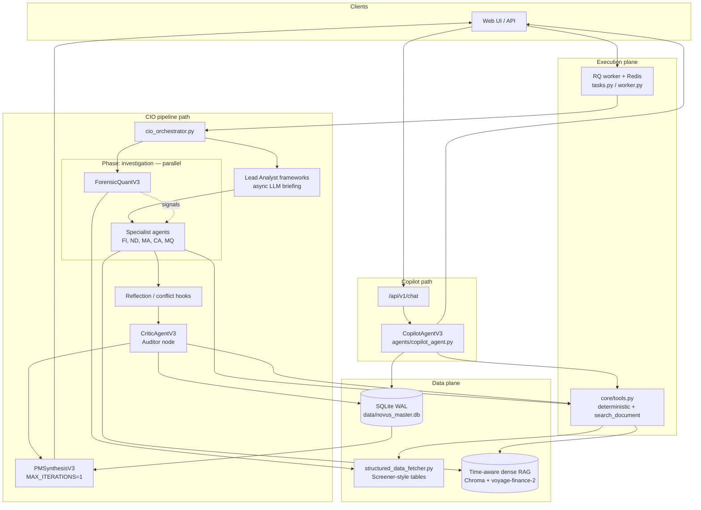

# Novus Architecture & Engineering Constitution

## 1. System Philosophy & Objectives

Novus is an institutional-grade financial LLM stack for **Indian equity research**, aimed at mutual funds, AMCs, and portfolio managers.

The product follows a **deterministic, audit-first extraction** philosophy. It rejects the “generative storyteller” pattern: numbers and causal claims must be traceable to **tools** or **document chunks**, not invented in prose.

**Core mandates**

- **Zero hallucination tolerance:** If a figure or claim is not in source filings, structured feeds, or a tool result, it is not asserted as fact.
- **Auditability:** Qualitative claims cite `chunk_id` (and related metadata); quantitative claims cite `get_metric` / `compute_ratio` / `compare_years` (or equivalent tool output).
- **Alpha over summarization:** Value comes from cross-time and cross-agent synthesis—narrative drift, disclosure gaps, forensic signals—not from faster reading alone.

---

## 2. End-to-End Architecture

Two user-facing execution paths share the same **tool registry**, **RAG store**, **memory DB**, and **ReAct engine**, but differ in orchestration:

| Path | Entry | Role |
|------|--------|------|
| **CIO pipeline** | Novus deep-dive job (ticker + mandate) | Multi-phase orchestration: parallel specialists → **Auditor** → PM synthesis |
| **Copilot** | `POST /api/v1/chat` in `app.py` | Single **CopilotAgentV3** ReAct loop with tools + memory tools; no Drafter–Critic entailment loop |

**Auditor routing (non-negotiable):** `EXECUTION_PHASES` in `cio_orchestrator.py` runs **verification** (`critic_agent`) **before** **synthesis** (`pm_synthesis`). Specialist JSON does not flow straight to the PM; the critic pass is the gate for structured corrections, temporal checks, and memory writes.

---

## 3. Time-Aware Hybrid RAG

“Hybrid” here means **structured financial tables + metadata-constrained dense retrieval**, not dense+BM25 (BM25 is not wired in `rag_engine.py` today; future optional enhancement).

### Ingestion & chunk metadata

- **Doc-type-aware chunk sizes** (`CHUNK_DEFAULTS` in `rag_engine.py`): larger chunks for annuals / tables; smaller for transcripts.
- **Section-aware** splitting via `SECTION_PATTERNS`.
- **Fiscal stamping:** `extract_fiscal_period()` reads **filename and document head** (first ~3k chars) with ordered regexes and Indian FY logic (Apr–Mar). Each chunk stores at least:
  - `fiscal_year`, `fiscal_quarter`, `fiscal_period` (canonical string, e.g. `Q3_FY26`)
  - `fiscal_detection_source`, `fiscal_confidence`
  - Legacy `year` / `quarter` where applicable (older chunks may be weaker on `year`; prompts and tools should prefer the new fields).

### Retrieval contract (`rag_engine.query`)

- Returns `{ text, metadata, distance, chunk_id, ... }` so agents and Copilot can cite **stable chunk identities**.
- **Temporal bleed guard:** Filters are combined with the ticker in a single Chroma **`$and`** clause. When provided, **`target_fiscal_year`**, **`target_fiscal_quarter`**, and **`target_fiscal_period`** are all applied as separate conjuncts (not OR’d away). Metadata is evaluated **before** embedding similarity.
- **No silent unfilter:** If the filtered query returns **zero** documents (or the query errors), the engine returns a single synthetic hit whose `text` is **`Data Unavailable for this specific fiscal period.`** It does **not** drop temporal filters and return semantically similar chunks from the wrong fiscal window.
- `min_year` remains for backward compatibility; **preferred** API for new code is `target_fiscal_period` (and matching `target_fiscal_year` / `target_fiscal_quarter` when callers split the period) aligned with orchestrator-inferred period (see below).

### Orchestrator alignment

- `cio_orchestrator._infer_fiscal_period(financial_tables)` derives the active period (e.g. latest quarter column on Screener-style tables → `Qn_FYyy`, else annual `FYyy`).
- That value is stored on `OrchestratorState.fiscal_period` and passed into **memory load/store** and **agent `execute(..., fiscal_period=...)`** so prompts, RAG filters, and SQLite rows stay on the same fiscal clock.

---

## 4. Auditor Node (CriticAgentV3)

The Auditor is the **verification phase**, not an optional post-processor.

**Responsibilities**

- Tool-backed verification of peer findings against `financial_tables` and `search_document`.
- **Temporal scan:** recursive walk of peer JSON with `utils.temporal_logic.verify_chronology` for stated `cause_date` / `effect_date` pairs (deterministic pre-filter before LLM judgment).
- **Schema discipline:** corrections and unverifiable claims carry `metric_category`, `fiscal_period`, `citations`, `confidence` so they land cleanly in memory.
- **Narrative inconsistencies:** echo / align with memory-detected cross-period contradictions when present.

**Memory side effects**

- High-confidence critic output is written via `MemoryLayer.store_corrections` / `store_agent_data_gaps` with **deduped** gap keys `(ticker, agent, metric_category, fiscal_period)`.
- **Narrative inconsistency pipeline:** Tier 1 uses **semantic similarity** (Voyage `voyage-finance-2`, same family as RAG) on fact pairs in a similarity **band** (`SIMILARITY_FLOOR`–`SIMILARITY_CEILING` in `core/memory.py`) to surface “same topic, different phrasing” candidates; Tier 2 is a bounded **ThreadPoolExecutor** (5 workers, 10s timeout per pair) LLM adjudicator for CONTRADICTION vs REFINEMENT vs UNRELATED. Fail-open: failed adjudication does not crash the run; pairs retry on later runs.

---

## 5. Deterministic Tool Execution

**Rule:** LLMs do not compute ratios from prose; they call tools.

**Shared registry (`core/tools.py`)**

- Quant: `get_metric`, `compute_ratio`, `compare_years`, `detect_anomaly`, `compute_cagr`, etc., over structured tables.
- **Math hardening (non-negotiable):** `compute_ratio`, `compare_years`, `detect_anomaly`, and `compute_cagr` wrap division in **`try` / `except`** for `ZeroDivisionError` and `TypeError`. If the denominator is **`0`, `0.0`, `None`, or empty**, the tool returns **`Data Unavailable`** (or an equivalent structured error) instead of a numeric garbage value.
- **Sanity bounds:** If a computed ratio, percentage change, or similar scalar would exceed an institutional plausibility band (e.g. absolute value **> 3650** for ratios / extreme YoY percentages used as a guardrail in code), the tool returns **`Data Unavailable: Out of Bounds`**. The model must not receive unbounded outputs from bad table cells or unit mix-ups (e.g. nonsensical “days” figures).
- Retrieval: `search_document` → uses `rag_engine.query`; results include **`chunk_id`**, `doc_id`, `page`, `section`, `relevance` for citations.

**PM / Copilot memory tools (`build_memory_tools`)**

- `get_management_inconsistencies`, `get_thesis_drift`, `get_negative_space_report`, `get_audit_trail` wrap `MemoryLayer` for **explicit** cross-period / audit views. Default agent **prompt injection** via `load_relevant_memories` is **single-period only** (see **Memory load confinement** under §6); cross-quarter thesis drift is opt-in through these tools, not ambient leakage.

**ReAct engine (`core/react_engine.py`)**

- `react_loop(..., on_step=...)` optional callback after each `ReasoningStep` (used by Copilot SSE streaming).
- Agents inherit `AgentV3` (`core/agent_base_v3.py`): `execute(..., fiscal_period=..., on_step=...)` runs the loop and logs investigation patterns into memory.

---

## 6. PM Synthesis & Stale Alpha Decay

**PM Synthesis (`agents/pm_synthesis.py`)**

- **`MAX_ITERATIONS = 1`:** forces a single generative pass over already-verified context—avoids runaway tool loops in the final thesis step.
- Output emphasizes **`alpha_synthesis`**, **`variant_perception`**, and explicit **BUY / WATCH / PASS** with kill criteria, not cost-center summarization.

**Stale alpha decay (“four-quarter” discipline)**

- **Retrieval:** agents and Copilot should pass **recent** `target_fiscal_period` / `min_year` into `search_document` unless the user explicitly asks for history.
- **Prompt layer:** `core/prompt_composer.py` includes temporal-fidelity rules; old quarters are treated as **consensus or background**, not fresh edge.
- **Memory reads:** `load_relevant_memories(..., target_fiscal_period=...)` injects **only** rows matching that fiscal period (see **Memory load confinement** below). High-confidence critic rows still use the existing confidence floor; period alignment is strict, not “prioritize then bleed.”

### Memory load confinement (`core/memory.py` — `load_relevant_memories`)

- **`agent_mistakes` and `data_gaps`** rows injected into prompts use **`WHERE fiscal_period = ?`** bound to **`target_fiscal_period`** from the orchestrator (or caller). There is no default lookback tier that re-injects older quarters into the same injection block.
- **If `target_fiscal_period` is empty:** the layer resolves the **most recent** `fiscal_period` for that ticker from `agent_mistakes` when possible; if no rows exist, it returns a **warning string** instead of loading cross-period rows.
- **Cross-period narrative inconsistencies** are **not** included in this default injection path (they remain in SQLite and in **PM-facing memory tools** for explicit cross-quarter analysis). That keeps specialist context from ambient cross-quarter contamination.

---

## 7. Copilot vs Legacy Chat Pattern

Previously, chat used a **Drafter + Critic** loop with strict literal entailment; analytical questions (“red flags”, “what changed in demand commentary”) often ended in **“Agent Loop Terminated”** because synthesis legitimately lacks verbatim substring matches.

**Current design:** `CopilotAgentV3` is a full **ReAct** agent (`VERIFY = False` for chat): grounding comes from **mandatory tool use** for numbers and **memory tools** for narrative drift. Progress streams over SSE via `on_step` from `react_loop`.

---

## 8. Background Jobs & Runtime

- **Flask:** `app.py` serves static UI and JSON/SSE APIs (default local port **5001** aligned with dev scripts).
- **Queue:** long-running Novus jobs enqueue to **Redis Queue** (`tasks.py`); **`worker.py`** drains the queue. Production-style reliability on macOS may use `launchd` plists under `scripts/` (logs, PATH, auto-restart)—operator-specific, not imported by Python.

---

## 9. Prompt Engineering Constraints (Summary)

| Constraint | Enforcement |
|------------|-------------|
| **Stale alpha decay** | Retrieval windows + prompt composer + strict memory fiscal period (`load_relevant_memories`) |
| **RAG zero-hit** | Explicit “Data Unavailable for this specific fiscal period.” — no filter drop |
| **Tool numerics** | Bounded / guarded outputs from `compute_ratio`, `compare_years`, `detect_anomaly`, `compute_cagr` |
| **Temporal hallucinations** | Critic `verify_chronology` sweep + human-readable date ordering rules |
| **Data gaps** | Explicit “could not be calculated” strings; gaps persisted to SQLite |
| **Citation** | `chunk_id` in RAG hits; tool names in agent JSON where applicable |

---

## 10. Codebase Map

| Concern | Primary files |
|----------|----------------|
| CIO state machine & fiscal inference | `cio_orchestrator.py` |
| ReAct loop & step callback | `core/react_engine.py` |
| Agent base & `execute` | `core/agent_base_v3.py` |
| Tools + memory tool builders | `core/tools.py` |
| RAG ingest, `extract_fiscal_period`, `query` | `rag_engine.py` |
| SQLite memory, semantic Tier 1, adjudication | `core/memory.py` |
| Specialist + PM + critic registry | `agents/all_agents.py`, `agents/*.py` |
| Auditor | `agents/critic_agent.py` |
| PM thesis | `agents/pm_synthesis.py` |
| Copilot agent | `agents/copilot_agent.py` |
| Chat API & SSE | `app.py` |
| Dynamic prompts | `core/prompt_composer.py` |
| Chronology helper | `utils/temporal_logic.py` |
| Structured data | `structured_data_fetcher.py` |
| Jobs | `tasks.py`, `worker.py` |

This document is the **engineering constitution**: when code and prose disagree, **code wins** until the doc is updated again.
